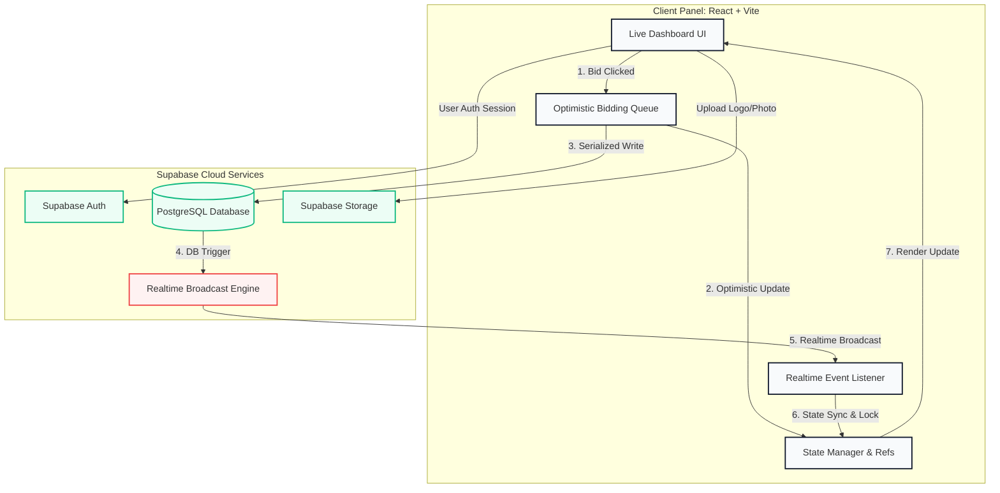

# 🏏 Cricket Auction Pro

> **Live Production Dashboard:** [https://aution-cric.netlify.app/](https://aution-cric.netlify.app/)
>
> A real-time, high-contrast brutalist cricket player draft console. Designed for tournament hosts to conduct live bidding sessions with concurrent race-condition prevention, instant public view boards, celebration modules, and premium sports newspaper roster exports.

---

## 🏗️ System Architecture

The application relies on a real-time event-driven loop backed by **Supabase PostgreSQL** and a **React optimistic state serial queue** on the client side.



---

## ⚡ Technical Core & Deep-Dive

### 1. Bidding Queue & Race Condition Protection
To handle rapid bids (e.g. multiple users bidding at the exact same millisecond) without database state rollback bugs:
* **Optimistic Local State Refs**: We bypass stale React closures using a combination of refs (`latestBidRef`, `latestBidderRef`) to track the client-first bid.
* **Serialized Write Queue**: A client-side queue processing function (`bidQueueRef` & `processBidQueue`) debounces rapid clicks and serializes outgoing writes to Supabase. Intermediate network updates are debounced, sending only the final synchronized bid count to avoid database locking.
* **Broadcast Filtering**: Realtime listener sync ignores out-of-order broadcasts where the incoming database state value is lower than the client's current optimistic bid.

### 2. Viewport-Locked Scrolling Dashboard
* **Desktop Heights**: The dashboard uses a CSS flexbox viewport constraint (`height: 100vh`, `overflow: hidden`) on desktop sizes.
* **Independent Scrolling**: The **Team Purses** panel uses a `.team-scroll` flex container with `overflow-y: auto`, allowing infinite teams to be scrolled independently while keeping the active player profile and auction control board pinned in place.

### 3. Newspaper Squad Exporter
* The PDF generator utilizes `jsPDF` to draw a custom sports editorial manifest.
* Includes dynamic **team-colored initials blocks**, custom double border lines, structured budget strips, two-column layouts, and a dashed **Squad Value Profile** widget detailing averages and budget utilization.

---

## 📊 Database Schema & Rules

### 1. Key Database Entities

```
┌─────────────────┐       ┌─────────────┐       ┌───────────────┐
│  tournaments    │ ◄───┐ │    teams    │ ◄───┐ │    players    │
├─────────────────┤     │ ├─────────────┤     │ ├───────────────┤
│ id (PK)         │     └─│ tournament_id│     └─│ team_id (FK)  │
│ name            │       │ id (PK)     │       │ id (PK)       │
│ date            │       │ name        │       │ name          │
│ budget          │       │ color       │       │ sold_price    │
└─────────────────┘       └─────────────┘       └───────────────┘
                                ▲
                                │
                          ┌─────────────┐
                          │auction_state│
                          ├─────────────┤
                          │tournament_id│
                          │active_player│
                          └─────────────┘
```

### 2. Row Level Security (RLS) Policies

For public live spectator viewer access, select tables allow public read rights whenever the tournament is flag-marked as live:

```sql
-- Allow read-only spectator viewer access
CREATE POLICY "Public can view live auction_state" ON auction_state
    FOR SELECT USING (is_live = TRUE);

CREATE POLICY "Public can view live teams" ON teams
    FOR SELECT USING (
        EXISTS (
            SELECT 1 FROM auction_state a
            WHERE a.tournament_id = teams.tournament_id
            AND a.is_live = TRUE
        )
    );

CREATE POLICY "Public can view live players" ON players
    FOR SELECT USING (
        EXISTS (
            SELECT 1 FROM auction_state a
            WHERE a.tournament_id = players.tournament_id
            AND a.is_live = TRUE
        )
    );
```

---

## 🚀 Quick Start & Development

### 1. Installation
```bash
# Clone the repository
git clone https://github.com/nikhil21111/cricket_aution.git
cd cricket_aution

# Install package dependencies
npm install
```

### 2. Database Migration
1. Set up a new project on [Supabase Console](https://supabase.com).
2. Execute the table schema migration script found in `database-schema.sql` inside the Supabase SQL editor.
3. Enable user signup authentication.

### 3. Environment Setup
Create a `.env.local` file in the project root containing your API credentials:
```env
VITE_SUPABASE_URL=https://your-project-url.supabase.co
VITE_SUPABASE_ANON_KEY=your-anon-key-here
```

### 4. Run Locally
```bash
npm run dev     # Boot development environment at http://localhost:5173
npm run build   # Compile optimized production bundle
npm test        # Run unit & logic verification tests via Vitest
```
