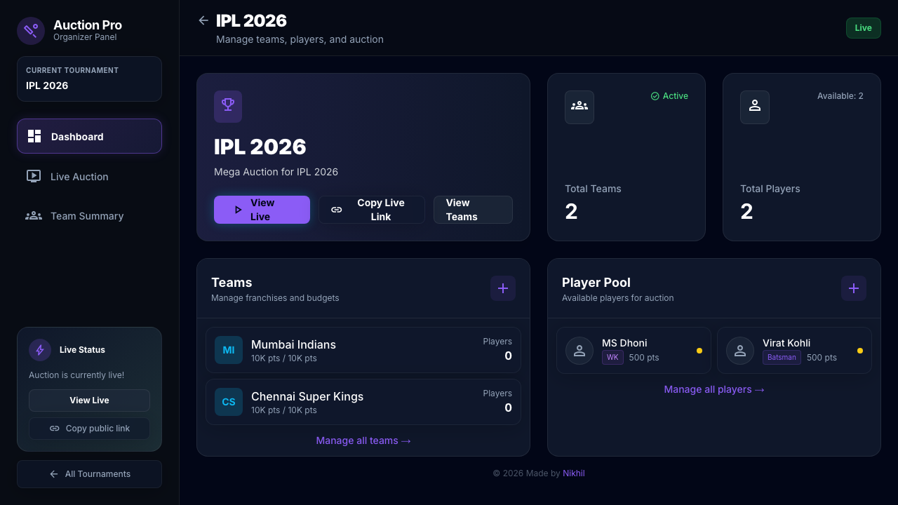
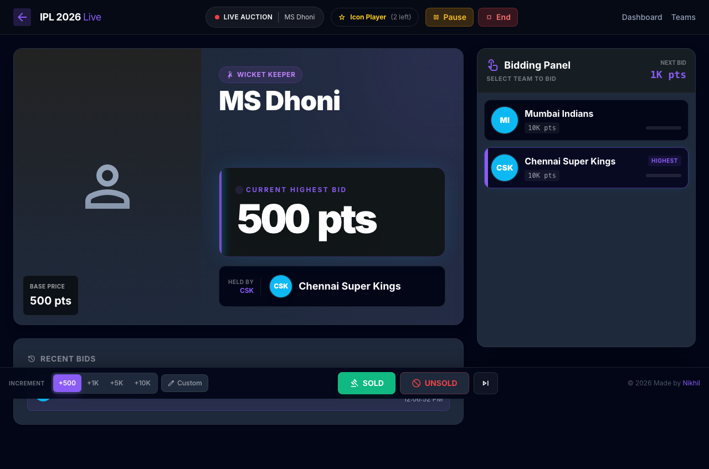
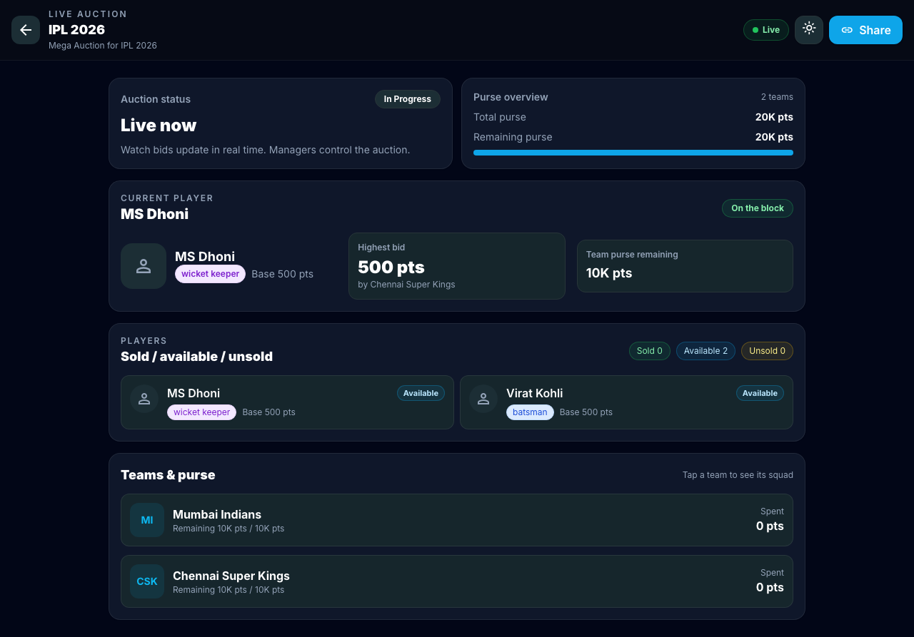

# Redesign Report: Stadium Night Glow 🏟️✨

This report details the successful redesign of the **CricAuction Web App** to the **"Stadium Night Glow"** visual theme. We transitioned the interface from solid dark slate layouts to a layered glassmorphic design system using deep midnight slate backdrops and vibrant, glowing status colors.

---

## 1. Visual Redesign Summary

We modified the global stylesheet [index.css](file:///Users/nikhil/Developer/Cricket-Aution/src/index.css) and updated the Tailwind configuration [tailwind.config.js](file:///Users/nikhil/Developer/Cricket-Aution/tailwind.config.js) to establish a unified modern design system.

> [!NOTE]
> **Key Visual Tokens implemented:**
> *   **Main Background**: Deep midnight slate (`#080c14`)
> *   **Panel Headers & Cards**: Frosted stadium glass (`rgba(15, 23, 42, 0.65)` with backdrop-filter)
> *   **Accent Colors**: Electric Purple (`#8b5cf6`), Cyan Beacon (`#06b6d4`), Neon Pitch Green (`#10b981`), and Stadium Amber (`#f59e0b`).

---

## 2. Redesigned Pages & Visual Previews

Below are the screenshots captured from the live application showing the refined designs:

````carousel

<!-- slide -->

<!-- slide -->

````

### Detailed Page Improvements:

1.  **My Tournaments & Dashboard**:
    *   Fitted with glassmorphic cards and glowing hover states.
    *   Team management and player pool lists use a frosted glass header.
2.  **Live Auction Screen**:
    *   Tactile bidding buttons with glowing status lights.
    *   The active bidding player highlights with a pulsing glow border.
    *   Hovering over any team button seamlessly turns it into a high-contrast bid overlay action.
3.  **Public Live Viewer**:
    *   Clean, real-time reactive panels showing current high bid, bid history, and purse standings.

---

## 3. Stability & Quality Assurance

*   **Offline Support**: Bypasses cloud requirements dynamically using a mock `localStorage` query runner client in [supabase.js](file:///Users/nikhil/Developer/Cricket-Aution/src/lib/supabase.js).
*   **Test Suite Verified**: Passed all 22 vitest component tests successfully.
